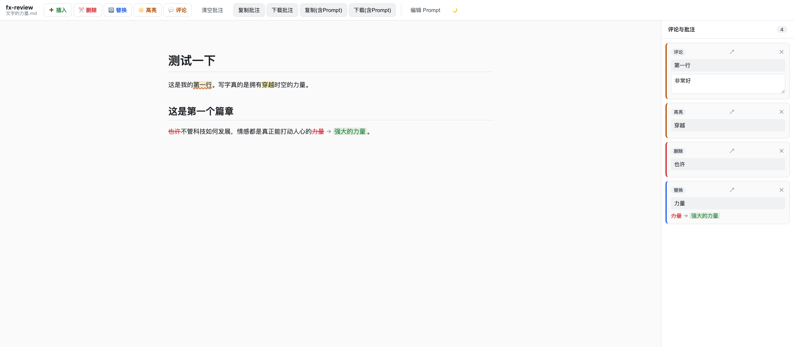

# fx-review

> 🌐 在线使用：[review.feixing.io](https://review.feixing.io) ｜ 📖 [English](./README.en.md)

网页版 Markdown 批注审阅工具。拖入本地 Markdown 文件 → 在渲染后的文字上做 CriticMarkup 批注 → 一键复制或下载带批注的全文，交给 AI 修改。无需下载安装，设备无关，部署在 Cloudflare Pages 上。



## 灵感与贡献

本项目受 [easychen/markmark](https://github.com/easychen/markmark) 启发——一个 macOS 原生的 Markdown 阅读器，用 [CriticMarkup](https://criticmarkup.com) 语法做文本批注，再把带批注的全文交给 AI 修改。

**我的创意与贡献**：保留 markmark 的核心创意（CriticMarkup 批注 + 一键交给 AI 的审阅闭环），但把它从原生 App **迁移到纯网页**：

- **零安装**：打开网页即可用，任何设备、任何系统，不挑 Mac/Windows/Linux。
- **文件不出本地**：Markdown 在浏览器内读取与渲染，不上传任何服务器。
- **自研源码偏移映射**：在渲染后的预览里选文字，能反向定位到源 Markdown 的精确字符位置，从而插入标准 CriticMarkup 标记——这是网页版最难的一环。
- **CSS Custom Highlight API 显示**：不修改渲染 DOM，反复批注不会让定位漂移。

与 markmark 的区别：markmark 是 Mac 原生阅读器（含编辑、PDF 导出、Mermaid 等），本项目聚焦"网页端轻量审阅"这一件事，门槛更低、设备无关。

## 定位

**不是 Markdown 编辑器**，而是"阅读 + 文本批注审阅"工具。关注点在文字内容，不在格式——如果 AI 生成的 Markdown 格式有误（标题层级、加粗位置），用评论批注告诉 AI 即可。

## 五种 CriticMarkup 批注

| 类型 | 语法 | 显示 |
|------|------|------|
| 插入 | `{++ 文字 ++}` | 绿色 |
| 删除 | `{-- 文字 --}` | 红色删除线 |
| 替换 | `{~~ 旧 ~> 新 ~~}` | 旧红删除线 → 新绿 |
| 高亮 | `{== 文字 ==}` | 黄色荧光笔 |
| 评论 | `{== 文字 ==}{>> 备注 <<}` | 淡黄波浪线 + 右侧栏 |

## 怎么用

### 1. 打开文件
把本地 `.md` 文件**拖到窗口任意位置**，或点击页面中央的"打开 Markdown 文件"按钮。文件在浏览器本地读取，不会上传。

### 2. 做批注
在渲染后的正文里**选中一段文字**，会同时出现两种操作入口：选区旁边的**浮动圆角菜单**（最快），以及顶部工具栏的 5 个批注按钮。

- **删除 / 高亮 / 评论**：选中文字后直接点对应按钮。
- **替换**：选中文字后点"替换"，输入新文字；正文里显示 ~~旧文字~~ → 新文字。
- **插入**：先在正文里点一下定位光标，再点"插入"，输入要新增的文字（绿色显示）。
- **评论**的备注在**右侧栏**里编辑——可以边看正文边写审阅意见，点击条目的 ↗ 可定位回正文。

> 批注不能重叠（CriticMarkup 语法限制）；想改同一段的不同意见，请用"替换"或在相邻位置分别批注。

### 3. 交给 AI
顶部右侧 4 个导出按钮：

- **复制批注** / **下载批注**：仅带 CriticMarkup 标记的全文。
- **复制(含Prompt)** / **下载(含Prompt)**：前置一段引导 Prompt，告诉 AI 如何理解这些标记。快捷键 `⌘/Ctrl + Shift + C`。

复制后粘贴到任意 AI 对话框即可；下载的 `.md` 文件可直接拖给 AI Agent。AI 会读懂 `{-- --}`（删）、`{++ ++}`（增）、`{~~ ~> ~~}`（换）等标记并输出修改后的完整文档。

### 其他
- **清空批注**：一键清除全部批注，恢复原文预览。
- **编辑 Prompt**：自定义"含 Prompt"导出时的引导词（会话内有效）。
- **主题**：右上角切换明暗，默认跟随系统。

## 工作原理

1. 用 markdown-it 渲染 Markdown，自定义渲染规则给每段渲染文本注入 `data-o="srcStart,srcEnd"`，把渲染 DOM 文本节点与源码字符偏移对齐。
2. 选中文字时，通过 `data-o` 反向解析出源码区间。
3. 显示层用 **CSS Custom Highlight API**（`::highlight`）着色，不修改渲染 DOM，因此反复批注不会让偏移漂移；插入类用 `<ins>` 节点点插入。
4. 导出时按源码偏移降序插入 CriticMarkup 标记，合成完整文本。

> 浏览器支持：CSS Custom Highlight API 需 Chrome/Edge 105+、Safari 17+、Firefox 140+。不支持时自动降级为 `<mark>` 包裹。

## 开发

```bash
npm install
npm run dev      # 本地开发
npm run build    # 类型检查 + 产出 dist/
npm run preview  # 预览构建产物
```

## 部署到 Cloudflare Pages

纯静态，无后端。线上域名：**[review.feixing.io](https://review.feixing.io)**（Pages 项目名 `fx-review`，production branch `main`）。

- **CLI**（当前用法）：`npm run deploy`（等价于 `npm run build && wrangler pages deploy dist`）。
- **Git 集成**（可选自动部署）：在 Cloudflare Pages 控制台连接本 GitHub 仓库，配置 Build command `npm run build`、Build output `dist`，之后 push 到 `main` 自动部署。
- **自定义域名**：在 Pages 项目 → Custom domains 添加 `review.feixing.io`，按提示配置 DNS。

## 技术栈

- Vite + TypeScript（原生，无框架）
- markdown-it（唯一运行时依赖）
- Cloudflare Pages（静态托管）

## 后续计划（v1 未做）

- Mermaid / PlantUML / KaTeX 渲染、Prism 代码高亮
- 批注持久化（localStorage / 跨设备同步）
- 多文件 / 标签页
- 移动端适配

## License

MIT
